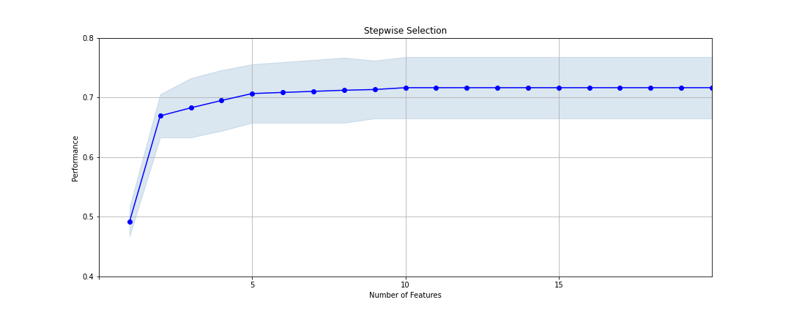
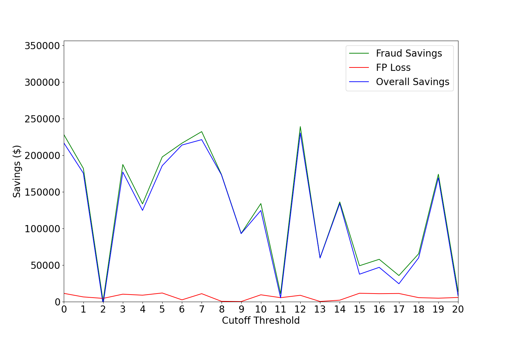

# Credit Card Transaction Fraud Detection

This project focuses on developing a machine learning-based fraud detection system for credit card transactions.  
The goal was to accurately identify fraudulent activity while balancing detection performance with business impact.

---

> 📄 **Full Project Report:**  
> [Read the detailed write-up (PDF)](./Credit%20Card%20Fraud%20Detection%20Report.pdf)

---

# Project Overview

Starting with raw transactional data, I built an end-to-end pipeline involving:

- **Data Cleaning:**  
  Handled missing merchant numbers and states, corrected ZIP code information using external data, and filtered transactions to retain only relevant records. Outliers (like extreme transaction amounts) were also addressed.

- **Feature Engineering:**  
  Created over 3,000 new variables capturing customer and merchant behaviors across multiple time windows (1, 3, 7, 14, 30, 60 days). Features included transaction counts, averages, maximums, variability measures, and geographical distance calculations.

- **Feature Selection:**  
  Used a two-stage approach:  
  - **Filter stage** based on Kolmogorov-Smirnov (KS) statistic to rank variables individually  
  - **Wrapper stage** using sequential forward selection with LightGBM to select the best multivariate feature set  

  

    
  

  
<em>Performance curve showing how model performance improves with the number of features selected. Performance plateaus after around 10 variables, indicating an optimal feature subset.</em>

- **Model Evaluation:**   
  Multiple models were evaluated using repeated randomized splits to manually cross-validate performance.  
  The best model achieved a Fraud Detection Rate (FDR) of **~0.631** at a 3% investigation rate on out-of-time (OOT) data.

- **Business Impact Analysis:**  
  Final predictions were converted into score percentiles and thresholds to simulate how a real-world investigation system would work.  
  A financial curve was created to estimate annual savings, based on these assumptions:
  - $400 saved per correctly detected fraud
  - $20 lost per false positive
  - Scaled to 10 million transactions/year using:

  > **Estimated Annual Savings** = (12/2) × (10,000,000 / 100,000) × (Observed Net Savings on OOT Sample)

  

    
  

  
<em>Estimated savings curve showing fraud savings (green), false positive losses (red), and overall net savings (blue) across different model thresholds.</em>

<em>Note: The savings curve appears jagged due to the rarity of frauds and the sensitive dependence on threshold settings. Small changes in score cutoff can lead to large swings in detected fraud amounts.</em>

  Based on these results, the model could save approximately **~$51 million/year** if deployed at scale.

---

# 🛠 Tools and Libraries Used

- **Python** (main programming language)
- **Pandas, NumPy** for data wrangling
- **Scikit-learn, LightGBM, CatBoost, XGBoost, MLxtend** for modeling and feature selection
- **Matplotlib, Seaborn** for visualizations

---

# 🔑 Key Outcomes

- Full fraud detection pipeline: from raw data → business-ready model
- Strong performance on unseen (OOT) data
- Focus on practical cost-benefit analysis, not just model accuracy
- End result: a deployable fraud detection system with large potential financial savings

